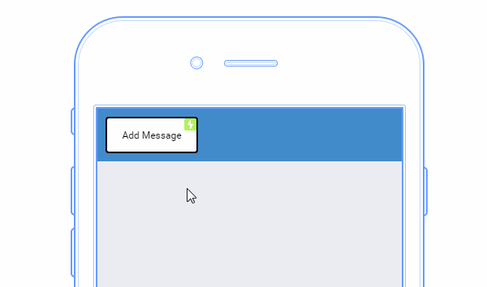

# Your UI isn’t a Disney Movie 

My previous short article about gratuitous animation really struck a chord with people. The response has been phenomenal and it’s been awesome reading others’ frustrations with overly animated UIs.
我上一篇关于滥用动效的短文引起了很多人的共鸣，反应非常热烈，同时也看到大家在那些滥用动效的界面里遇到不少问题。

To be clear, I’m not anti motion design for UIs. Far from it. I have a problem with animation that serves only to get in the way of the end user.
先明确一下，我不是反对在 UI 设计的过程中使用动效，问题仅出在那些对用户体验造成影响的动效身上。

One of the clearest signs of a competent UI designer is restraint. It’s about knowing the capabilities of your chosen platform and then not using them (until the perfect opportunity arises).
「克制」是一个优秀 UI 设计师所必须具备的素质。它要求设计师在充分了解相应平台性能的前提下不滥用动效——除非具备完美的条件。

Rather than just bemoaning the use of unnecessary animation, I’ll do my best to suggest scenarios that would benefit from considered use of animation.
与其为了那些没用的动效而长吁短叹，我宁可选择去努力挖掘那些经过深思熟虑的动效方案。

I look forward to hearing your comments and suggestions about this topic.

## A Contrived Example

The following is a quick, contrived example that I came up with to demonstrate the Disneyfication of UI motion design. Although this is an exaggerated example, in truth there are many UIs out in the wild that exhibit this kind of garish motion.

[Click here](https://www.ux-app.com/device/view?s=MRGG9547&l=&pg=35687)to see a live version of this demo.

It’s almost like we’ve abandoned visual skeuomorphism and replaced it with behavioral skeuomorphism in which our digital objects act as though they are made from jelly, or dangling from invisible rubber bands.
这就好像我们抛弃了视觉的拟物化，而投奔了「动作」的拟物化，这些「电子物件」像啫喱一样弹跳着，又像被一条无形的橡皮筋悬挂着一样。

## Stop Wanton Animation

Animation is like cursing. If you overuse it, it loses all its impact.
动效就像诅咒，如果你滥用，就会失效。

## Animation Principles

I’ve heard some UI designers suggest Disney’s animation principles as required reading for UI designers. Unfortunately this helps to promote the idea of UI as entertainment, which invariably leads to a UI that slows the user down.
我听到很多 UI 设计师建议使用迪士尼的那套动效原则。但我觉得这只对展示那些娱乐类型的 UI 设计有帮助，这些动效会拖慢用户的进度。

Many UI motion designers seem to treat their user interfaces like animation portfolios. Unless you’re hoping to get picked up by Pixar, you can probably steer clear of animation easing like “Bounce” or “Ease-in-Out”.
很多 UI 动效设计师把界面做得像动效作品集一样。除非你想获得 Pixar 的 offer，不然的话，你就别用那些「Bounce」或者「Ease-in-Out」之类的缓动函数了。

## What is an Interface?

> In computing, an interface is a shared boundary across which two separate components of a computer system exchange information.
> 
> Interface (computing) — Wikipedia, the free encyclopedia
> https://en.wikipedia.org/wiki/Interface_(computing)

It’s the interface’s responsibility to mediate an information exchange which makes it so important. The challenge for designers is to determine when their design gets in the way of this central UI tenet.

## Motion in UI Design

Here are some simple principles that have worked well for me and which I recommend:

- Be able to justify the use of each animation in terms of benefit to the user. “It looks pretty” doesn’t qualify.
- Keep animation duration at or under 300ms
- Avoid Linear animation easing. It makes motion look slow, uninteresting and mechanical.
- 99% of animations should use a simple “Ease-In” or “Ease-Out” animation easing.
- You only rarely need more exotic animation easing such as Spring, Bounce etc.

## Some UI Examples

Please feel free to criticize/pick apart these examples. Your comments and suggestions often help refine my own thinking on these matters.

### Notifications

[Click here](https://www.ux-app.com/device/view?s=MRGG9547&l=1&pg=36655) to see a live version of this demo.

A simple animation that only lasts for 300ms. There is a very subtle layering effect whereby the message is faded in 100ms after the red card’s animation starts. The use of motion in this example does enhance the users experience of the app because it helps draw the user’s eye to an important notice that can’t be ignored.

### That Escalated Quickly

[Click here](https://www.ux-app.com/device/view?s=MRGG9547&l=1&pg=36656) to see a live version of this demo.

The demo above uses animation that escalates in intensity.

- On the first click the notice fades in
- On the second click the label shakes

If the user continues to click the button then an optional modal overlay could be used to draw the user’s attention to the issue.

Additionally the button itself could change color to indicate a failure on subsequent failed tries.

### Card Expand

This is one of those simple, yet very effective implementations of a card view which is commonly used on mobile. I really like this interaction because it allows the user to maintain context. Even though our view of the list is obscured, we know it’s sitting right there behind the expanded view.

[Click here](https://www.ux-app.com/device/view?s=MRGG9547&l=1&pg=36662) to see a live version of this demo.

I’ve purposely slightly delayed showing the close icon for the card and I’ve used a transition that animates both position and opacity. This draws the user’s eye to an important UI element which the user will need to be aware of to be able to dismiss the card.

### Hierarchy of Importance

As designers and developers one of the most important things we do is to decide which elements of our UI are more important than others. We do this in a number of ways

- By using headings
- Underlining, or making text bold
- Use of color
- Use of shapes and images
- Motion

You wouldn’t make every sentence of a document into a heading. The same principle applies to animation. Consider every animated element in your UI to be the equivalent of a heading in a written document. It should be used to signal the importance of an element. Overusing it simply flattens out your hierarchy and dilutes the message you are trying to communicate.

## Functional vs Aesthetic Animation

Programmers often talk about code in terms of ‘code smell’. This refers to features of programming code that may not be outright bad, but which do set off a seasoned programmer’s spidey sense to potentially poor code.

If you begin to hear team members talk of UI animation using terms such as ‘delighting’ the user, your ‘design smell’ alarm bells should probably start going off. Animation for animation’s sake is (almost always) poor design.

Remember, less is more with regard to animation. Functional always trumps purely aesthetic animation.

Don’t let your animations get in your user’s way. There’s a reason why an airplane’s navigational UI doesn’t use any animation. Adding an unnecessary 300ms animation to your UI probably won’t kill anyone, but it will annoy your users far more than it will ‘delight’ them!

## Final Thoughts

By all means use animation in your UI. Use it as a high-bandwidth way to quickly communicate important information. Favor functional over purely aesthetic animation, and value those precious milliseconds your users are devoting to your UI.

